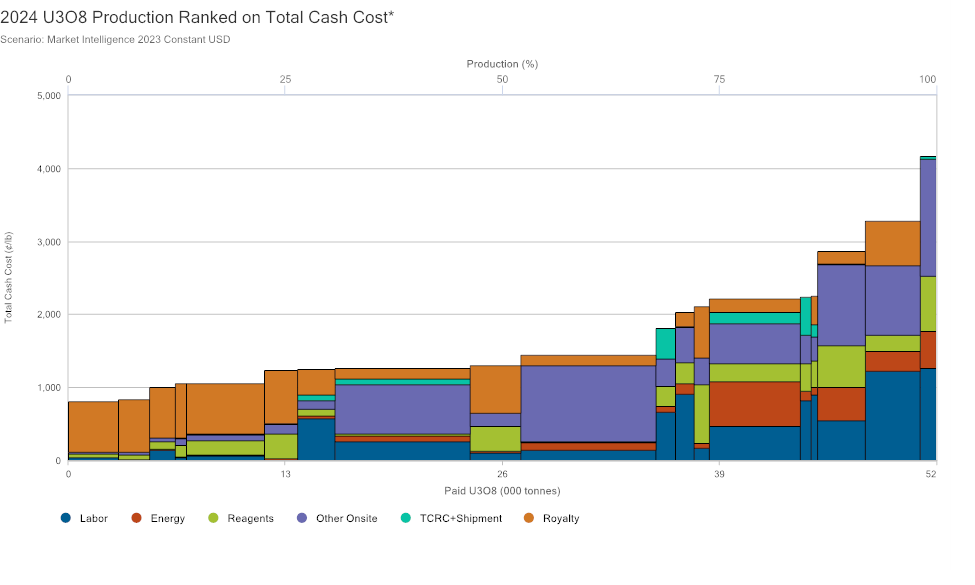
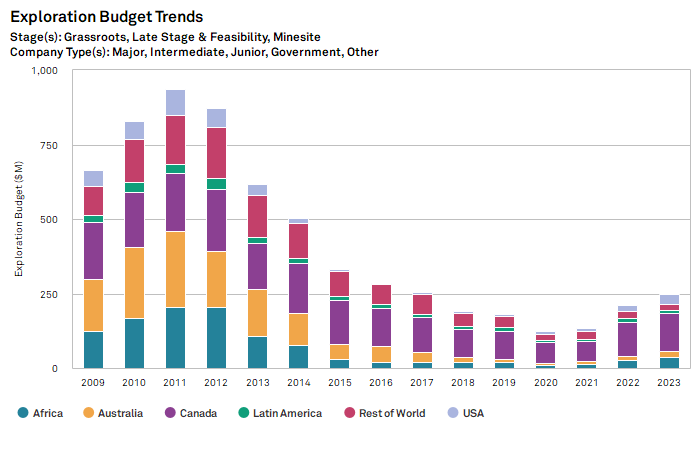
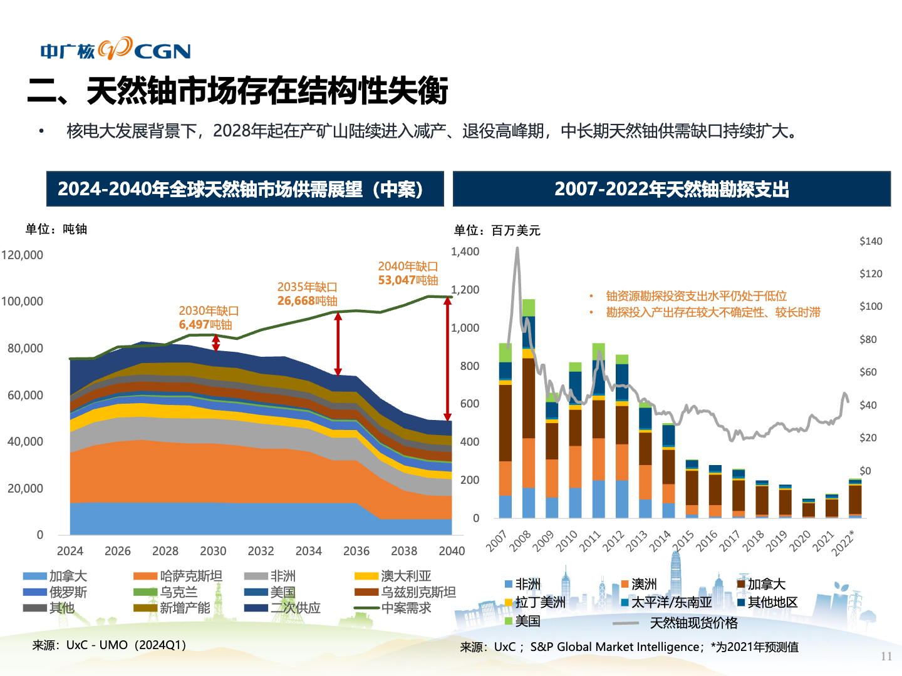

# 铀矿
[铀矿Wiki](https://zh.wikipedia.org/zh-cn/%E9%88%BE)

[铀矿的储量Wiki](https://zh.wikipedia.org/wiki/%E5%90%84%E5%9B%BD%E9%93%80%E5%82%A8%E5%A4%87%E9%87%8F%E5%88%97%E8%A1%A8)

[最大的铀矿供应商JSC National Atomic Company Kazatomprom的财务整理 -Google Sheets](https://docs.google.com/spreadsheets/d/1QZiK500M5earggfEJD5rqAxNBIBfMQ00RZt0DwpX97U/edit?usp=sharing)

[成本最低的矿](https://docs.google.com/spreadsheets/d/1QZiK500M5earggfEJD5rqAxNBIBfMQ00RZt0DwpX97U/edit?gid=1693205601#gid=1693205601&range=A11:U11)都在哈萨克斯坦

近 10 年因为日本大地震的原因，[资本开支](https://docs.google.com/spreadsheets/d/1QZiK500M5earggfEJD5rqAxNBIBfMQ00RZt0DwpX97U/edit?gid=630386563#gid=630386563&range=A9:P9)很少了。

根据中广核矿业的估计，2030 年以后铀矿会处于供不应求的阶段。而且因为铀矿的开采周期很长，可能这个情况会持续 
[调研录音《2024-06-13 15_47 中广核矿业记录-放大》](https://tingwu.aliyun.com/doc/transcripts/dej8nbxovoerqpog?sl=1#)

## Todo
1. 全球重启核电站的新闻及规划
2. 核电站功率和铀矿需求的关系
3. 前面 10 年铀矿由老矿来供给的供给的相关数据

## Inbox临时资料库
[《We Study Billionaires – NUCLEAR POWER AND BITCOIN》](https://tongyi.aliyun.com/efficiency/doc/transcripts/wg57n33kkoo5nkr3?sl=1&source=1#)

[第四代反应堆](https://zh.wikipedia.org/zh-cn/%E7%AC%AC%E5%9B%9B%E4%BB%A3%E5%8F%8D%E6%87%89%E5%A0%86#cite_note-28)使用新式设计后，同样数量的核燃料多产出100至300倍的能量。
